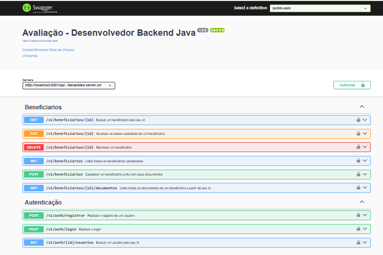
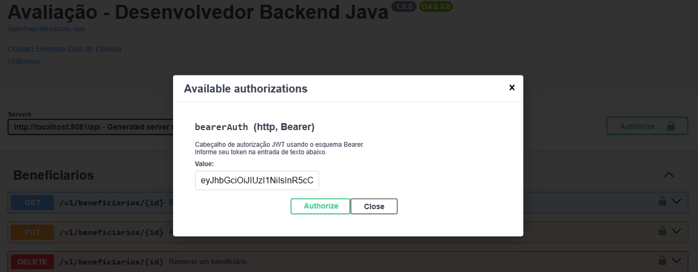

<h1 align="center">
Avaliação - Desenvolvedor Backend Java 
</h1>

<p align="center">
  Criar uma aplicação utilizando Java e Spring Boot que forneça uma API REST para manter o cadastro 
de beneficiários e seus documentos de um plano de saúde.
</p>

## Requisitos
- Git instalado - [**Download**](https://git-scm.com/downloads).
- JDK 17 instalado - [**Download**](https://www.oracle.com/java/technologies/javase/jdk17-archive-downloads.html).


## Iniciando
``` bash
  # Clonar o projeto:
  $ git clone https://github.com/diasRibeirao/avaliacao-ekan.git

  # Entrar no diretório do projeto:
  $ cd avaliacao-ekan
```

## Executando o Projeto
```bash
  # Instalar as dependências:
  $ mvn clean install 

  # Rodar a aplicação:
  $ mvn spring-boot:run

  # Rodar a aplicação com o CMD:
  $ Executar o seguinte comando: java -jar target/avaliacao-ekan-0.0.1-SNAPSHOT.jar

```

## Banco de Dados

#### [**http://localhost:8081/api/h2-console/login.jsp**](http://localhost:8081/api/h2-console/login.jsp)
```bash
 spring.datasource.driverClassName=org.h2.Driver
 spring.datasource.url=jdbc:h2:mem:ekandb
 spring.datasource.username=sa
 spring.datasource.password=
```

## Endpoints

#### [**http://localhost:8081/api/swagger-ui/index.html**](http://localhost:8081/api/swagger-ui/index.html)



## Executando o Endpoints

### Autenticação
```bash
  # Realiza o registro de um usuário:
  # Método: POST
  http://localhost:8081/api/v1/auth/registrar

  # Realiza o login:
  # Método: POST
  http://localhost:8081/api/v1/auth/login

  # Buscar um usuário pelo seu id (Necessita Autenticacação):
  # Método: GET
  http://localhost:8081/api/v1/auth/1/usuarios
```
### Autenticar nos Serviços

#### Após realizar o login, inserir o token (accessToken) na entrada de texto do modal aberto ao clicar no botão com cadeado no topo "Authorize":



### Beneficiarios (Todos Necessitam Autenticacação)
```bash
  # Cadastrar um beneficiário junto com seus documentos:
  # Método: POST
  http://localhost:8081/api/v1/beneficiarios

  # Atualizar os dados cadastrais de um beneficiário
  # Método: PUT
  http://localhost:8081/api/v1/beneficiarios/1
  
  # Listar todos os beneficiários cadastrados (Com Paginação):
  # Método: GET
  http://localhost:8081/api/v1/beneficiarios?page=0&size=1&sort=nome
  
  # Buscar um beneficiário pelo seu id:
  # Método: GET
  http://localhost:8081/api/v1/beneficiarios/1
  
  # Listar todos os documentos de um beneficiário a partir de seu id:
  # Método: GET
  http://localhost:8081/api/v1/beneficiarios/1/documentos
  
  # Remover um beneficiário:
  # Método: DELETE
  http://localhost:8081/api/v1/beneficiarios/1
```

<br /><br />
Emerson Dias de Oliveira<br />
https://github.com/diasRibeirao
